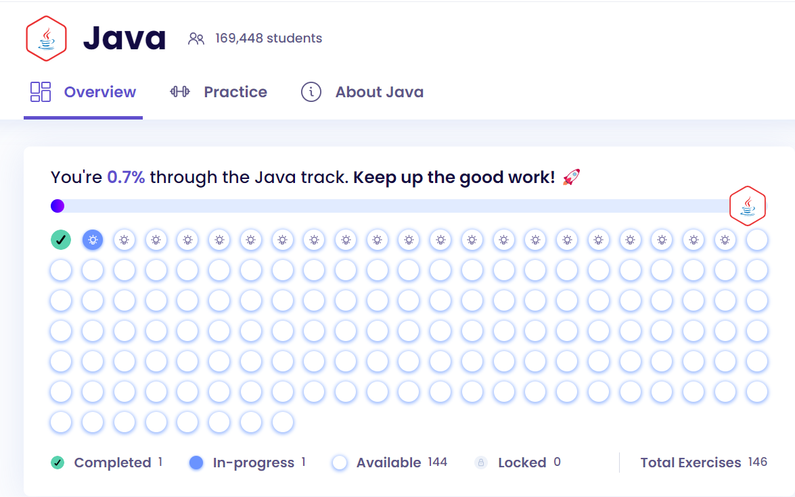

# 146 day Java Challenge.

### About the challenge

 This challenge aims to do 146 exercises from [exercism](https://exercism.org/dashboard). It's going to be one exercise a day, and one commit a day until the end of the challenge. At the end of the exercise, tell a bit about the exercise and how it was.

For every exercise there will be a description about the problem and the following solution.

### About Exercism

Exercism is a platform with problems to solve in any language, for this challenge, it was choosen the Java language. The website is free and it helps to train algorithms and logic. 
The website is very complete, it has a compiler so you can code, has a big community to help with the problems. 

